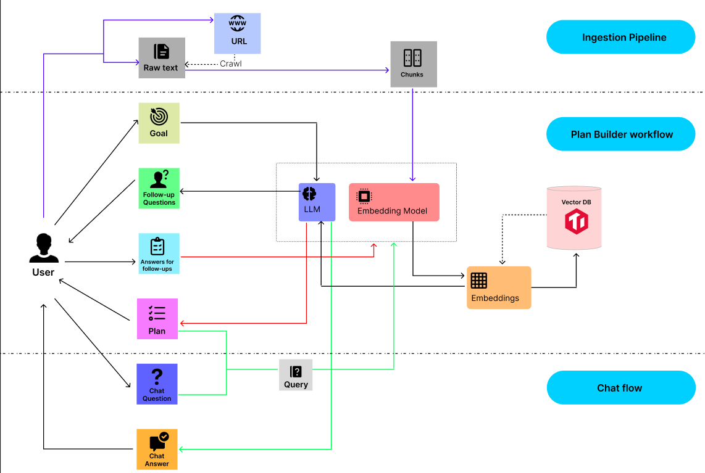

# DocuMatey

Turn your documentation into an agentic workflow: index docs, clarify goals, generate a step‑by‑step plan with citations, and chat with grounded answers.

## Overview
DocuMatey helps you:
- Index documentation (crawl same‑host URL or paste text) into a vector store.
- Ask clarifying questions to firm up requirements.
- Generate an implementation plan with citations and GitHub‑flavored Markdown details.
- Chat against the selected plan step with retrieval grounded to relevant docs.

## Features
- Same‑host site crawler with HTML cleanup, normalization, sentence‑aware chunking, and overlap.
- Google Gemini for LLM generation (clarify, plan, chat) and text embeddings.
- TiDB Vector for semantic retrieval (cosine similarity, HNSW index).
- Next.js App Router UI that orchestrates Index → Clarify → Plan → Chat.

## Stack
- Frontend: Next.js (App Router), React, TypeScript, Tailwind‑style utilities, React Markdown + syntax highlighting.
- Backend/API: Next.js server routes (Node.js runtime), JSON over HTTP.
- AI/Embeddings: Google Gemini (LLM + text‑embedding‑004 by default).
- Vector Store: TiDB Vector (cosine distance, HNSW index).
- Crawler/Text: fetch + Cheerio, normalization, chunking with overlap.

## High‑level Architecture



## Prerequisites
- Node.js 20.x (LTS) and npm 10.x
- Google Generative AI API key
- TiDB Vector (Serverless/Cloud) credentials

## Setup

1) Install dependencies
```bash
npm install
```

2) Create `.env.local`
```bash
# TiDB (MySQL‑compatible)
TIDB_HOST=your-tidb-hostname
TIDB_PORT=4000
TIDB_USER=xxxx.root
TIDB_PASSWORD=your_password
TIDB_DATABASE=test

# Google Gemini
GOOGLE_API_KEY=your_google_api_key

# Optional overrides
LLM_MODEL=gemini-2.5-pro
EMBEDDING_MODEL=text-embedding-004
# Must match the embedding dimension for your EMBEDDING_MODEL (text-embedding-004 = 768)
EMBEDDING_DIM=768

# Optional crawler tuning
CRAWL_MAX_PAGES=30
CRAWL_MAX_DEPTH=2
CRAWL_DELAY_MS=150
```
Notes:
- Ensure your TiDB cluster allows connections. SSL/TLS is enabled by default in the app.
- The vector column dimension must match the embedding model dimension (text‑embedding‑004 = 768).

## Run

Development
```bash
npm run dev
# Open http://localhost:3000
```

Production
```bash
npm run build
npm run start
# or: next start
```

## Usage
1) Index
- On the homepage, either paste a documentation URL (same‑host crawl) or paste raw text.
- The app will fetch → clean → chunk → embed → upsert vectors into TiDB.

2) Clarify
- Enter your goal. The system proposes 3–7 targeted follow‑up questions to firm up constraints.

3) Plan
- Generate an actionable plan (Markdown details with code blocks), with per‑step citations and assumptions.

4) Chat
- Ask questions grounded to the currently selected plan step. Answers include citations and are constrained by step context and retrieved snippets.

## API Reference

- POST /api/index
  - Body: `{ url?: string; text?: string }`
  - Response: `{ message: string; chunks: number; source: 'url_crawl' | 'text' }`
  - Purpose: Crawl or accept text, chunk, embed, and upsert vectors.

- POST /api/clarify
  - Body: `{ goal: string; context?: Record<string,string> }`
  - Response: `{ questions: Array<{ id: string; text: string; options?: string[] }> }`
  - Purpose: Generate targeted clarifying questions (strict JSON).

- POST /api/plan
  - Body: `{ goal: string; answers?: Record<string,string>; topK?: number }`
  - Response: `{ assumptions: string[]; steps: Array<{ id: string; title: string; detail: string; check: string; estimated_time_min: number; citations: Array<{ url: string; evidence: string }> }>; citations: Array<{ url: string; evidence: string }> }`
  - Purpose: Retrieval‑augmented plan with citations and Markdown details.

- POST /api/chat
  - Body: `{ message: string; stepId?: string; stepDetail?: string; stepCitations?: Array<{ url: string; evidence?: string }>; assumptions?: string[]; history?: Array<{ role: 'user' | 'assistant'; content: string }>; topK?: number; filters?: { sourceHost?: string; sourcePrefix?: string }; strict?: boolean }`
  - Response: `{ answer: string; citations: Array<{ url: string; evidence: string }> }`
  - Purpose: Grounded Q&A constrained to the selected step context with retrieval.

- GET /api/status
  - Response: `{ count: number, error?: string }`
  - Purpose: Quick health/size check of indexed vectors; used by the UI to allow skipping indexing if data exists.

- POST /api/search (optional utility)
  - Body: `{ query: string; topK?: number; filters?: { sourceHost?: string; sourcePrefix?: string } }`
  - Response: `{ results: Array<{ source_url: string | null; content: string; distance: number }> }`
  - Purpose: Ad‑hoc semantic search for debugging or future UI features.

## Troubleshooting
- "GOOGLE_API_KEY is not set"
  - Create `.env.local` with `GOOGLE_API_KEY` and restart the dev server.
- EBADENGINE warnings (e.g., undici)
  - Update Node to 20.x (`node -v`) and restart the terminal.
- No indexed data found
  - Use the Index step or call `/api/index` to add data. `/api/status` shows current chunk count.
- Poor retrieval quality
  - Prefer indexing authoritative sources; use Chat with a selected plan step so host/path filters keep answers on‑topic.

## Deployment
- The app is compatible with Vercel’s Next.js hosting.
- Ensure required environment variables are set on the platform.
- Consider adding rate‑limits and auth before exposing publicly.

## Learn More
- Next.js: https://nextjs.org/docs
- TiDB Vector Search Overview: https://docs.pingcap.com/tidbcloud/vector-search-overview/
- TiDB Vector Search Index (HNSW): https://docs.pingcap.com/tidbcloud/vector-search-index/
- Google Gemini Embeddings: https://ai.google.dev/gemini-api/docs/embeddings
- Google Gemini Models: https://ai.google.dev/gemini-api/docs/models
